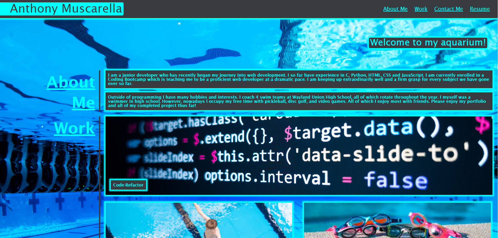

# ProfessionalPortfolio
I bulit this website to present me and my accomplishments thus far as a learning developer. It will showcase my talent and will allow employers to guage my skill and general understanding of web development as well as other programming skills. Creating this website in itself was my first great challenge and it opened the door to a vast amount of new found techniques and strategies for bulidng a webiste with HTML and CSS.

## Installation 
N/A

## Usage 
A refernece for employers to view and guage my skill as a developer when considering hiring me.

https://muscarellaanthony.github.io/ProfessionalPortfolio/

## Credits
N/A

## License
MIT License

Copyright (c) 2024 muscarellaanthony

Permission is hereby granted, free of charge, to any person obtaining a copy
of this software and associated documentation files (the "Software"), to deal
in the Software without restriction, including without limitation the rights
to use, copy, modify, merge, publish, distribute, sublicense, and/or sell
copies of the Software, and to permit persons to whom the Software is
furnished to do so, subject to the following conditions:

The above copyright notice and this permission notice shall be included in all
copies or substantial portions of the Software.

THE SOFTWARE IS PROVIDED "AS IS", WITHOUT WARRANTY OF ANY KIND, EXPRESS OR
IMPLIED, INCLUDING BUT NOT LIMITED TO THE WARRANTIES OF MERCHANTABILITY,
FITNESS FOR A PARTICULAR PURPOSE AND NONINFRINGEMENT. IN NO EVENT SHALL THE
AUTHORS OR COPYRIGHT HOLDERS BE LIABLE FOR ANY CLAIM, DAMAGES OR OTHER
LIABILITY, WHETHER IN AN ACTION OF CONTRACT, TORT OR OTHERWISE, ARISING FROM,
OUT OF OR IN CONNECTION WITH THE SOFTWARE OR THE USE OR OTHER DEALINGS IN THE
SOFTWARE.

